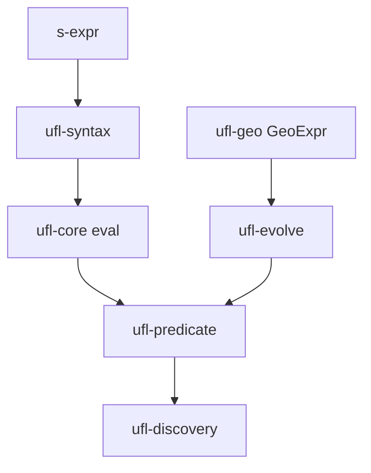

# Arquitectura — ufl

## Propósito

Research project: EML tree, Hehner predicates, tensor verification, GA kernel, geometric neuroevolution — substrate-agnostic computation.

## Mapa de módulos

```
ufl/crates/
├── ufl-core/       # EML numeric core
├── ufl-syntax/     # s-expr → EML
├── ufl-predicate/  # Hehner ⟦P⟧ checker
├── ufl-tensor/     # Strassen scheme verifier
├── ufl-discovery/  # GA search + discharge
├── ufl-ga/         # Cl(3,0,1) over garust
├── ufl-geo/        # GeoExpr AST, grade types
└── ufl-evolve/     # Memetic/neuroevolution
```

## Diagrama de componentes



## Capas y responsabilidades

Ver [code-walkthrough.md](./code-walkthrough.md) para el recorrido módulo a módulo.

## Documentación adicional

- `docs/why-ufl.md`
- `docs/the-shape-of-ufl.md`
- `theory/`
- `requirements/`
