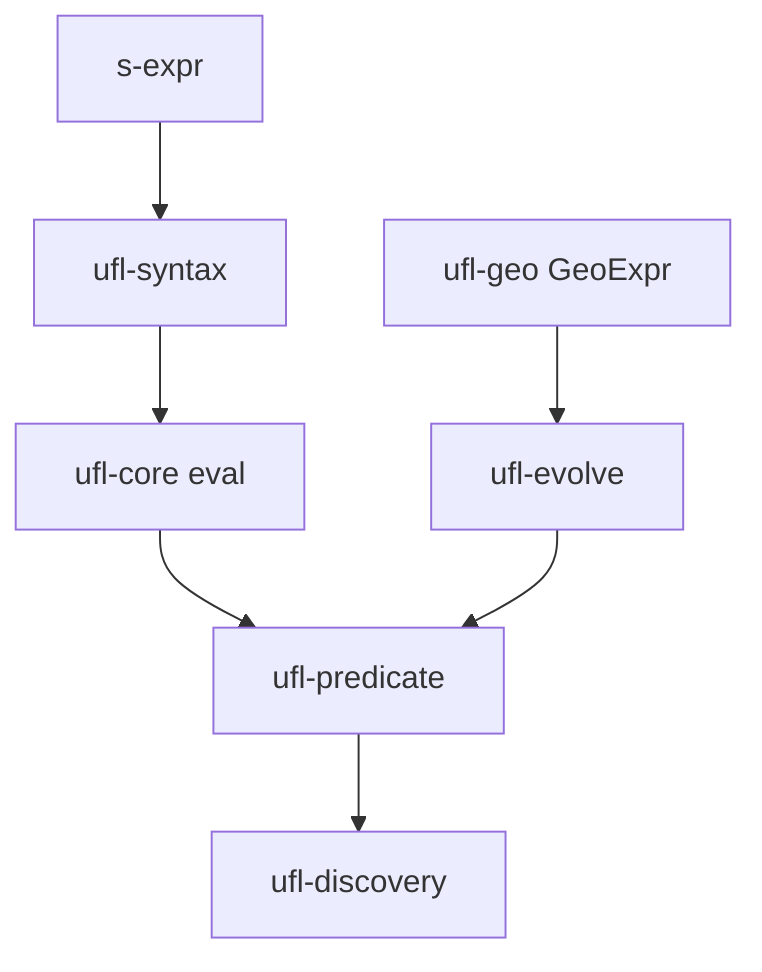
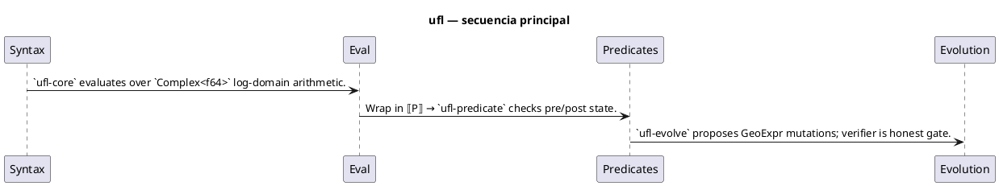
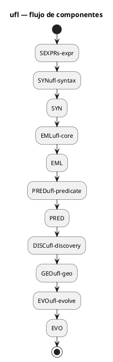

# Flujos — ufl

## Flujo principal (Mermaid)

## Descripción paso a paso

1. **Syntax** — s-expr reader → `ufl-syntax` lowers to EML tree.
2. **Eval** — `ufl-core` evaluates over `Complex<f64>` log-domain arithmetic.
3. **Predicates** — Wrap in ⟦P⟧ → `ufl-predicate` checks pre/post state.
4. **Evolution** — `ufl-evolve` proposes GeoExpr mutations; verifier is honest gate.

## Secuencia (PlantUML)

Fuente: [`diagrams/flow-sequence.puml`](./diagrams/flow-sequence.puml)

## Componentes / estados (PlantUML)

Fuente: [`diagrams/flow-architecture.puml`](./diagrams/flow-architecture.puml)

## Estados y casos borde

Consulta los tests de integración y los RFC/requirements del proyecto para flujos de error y recuperación.
